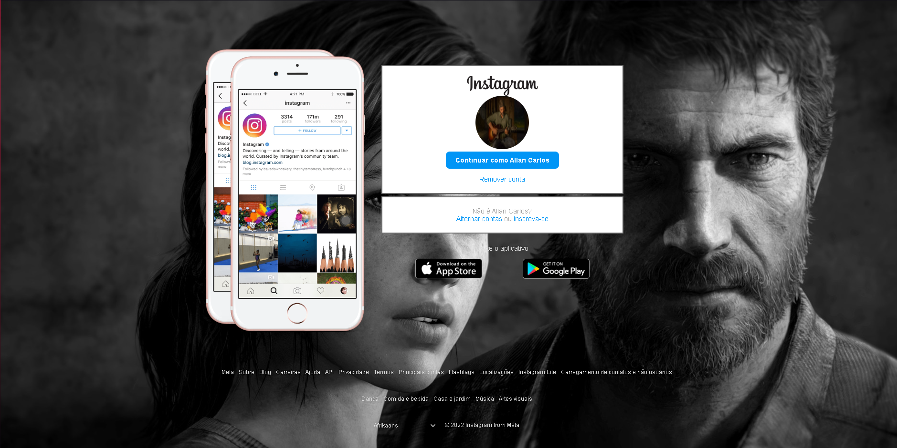
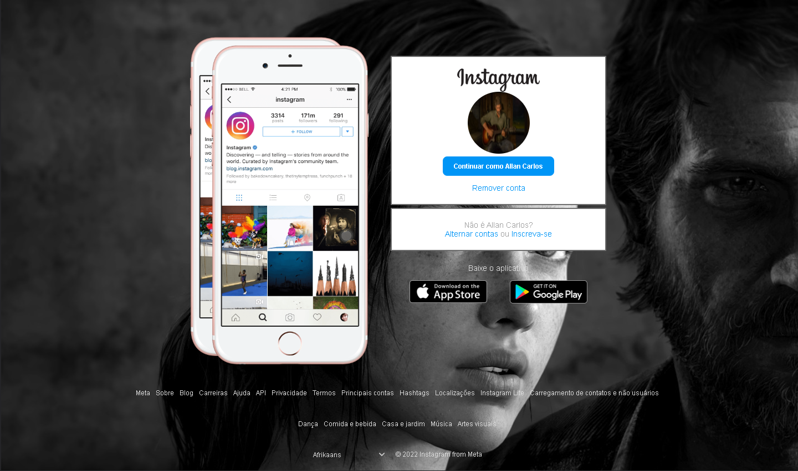
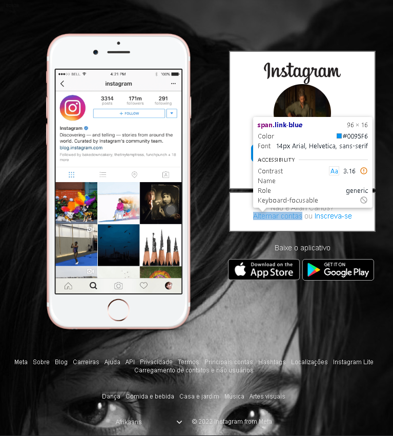
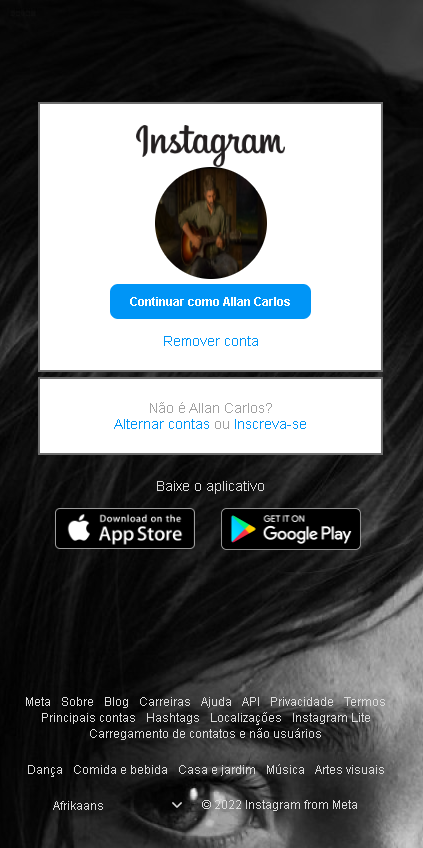

# 🚀 Desafio Flexbox Recriando Instagram 🚀

Esse projeto está disponível no bootcamp **Impulso Javascript Evolution** na plataforma da **DIO** e é uma implementação do desafio utilizando Flexbox para recriar a página inicial do Instagram e aplicar as minhas próprias adições e melhorias baseado num modelo feito durante o curso.

## Lista de Adições e Melhorias ⬆️

 - Eu aumentei a borda do login/cadastre-se e mudei a cor para se ajustar com a imagem;

 - Adicionei mais um celular para ficar bem parecido com a página real do Instagram;

 - Adicionei o footer com links, o select de linguagem estilizado para ficar parecido com o original (incluindo a seta dropdown 🔽) e o Copyright;

  - Ajustei o footer para ficar responsivo em resoluções menores;

 - Mudei o tema da página para um jogo que eu gosto muito que é o The Last of Us;

 - Ajustei a responsividade desse segundo celular para monitores com resoluções menores e retirei ele na resolução de um tablet (no mobile não precisei mexer, pois ele não aparece).

## Imagens do Projeto 🖼️

- Imagem da tela de um monitor em alta resolução: 

  

- Imagem da tela menor, seja por resolução ou tamanho do navegador:
 
  

- Imagem da tela com a resolução de um tablet:

  

- Imagem da tela com a resolução de um celular: 

  

É isso! 😃
